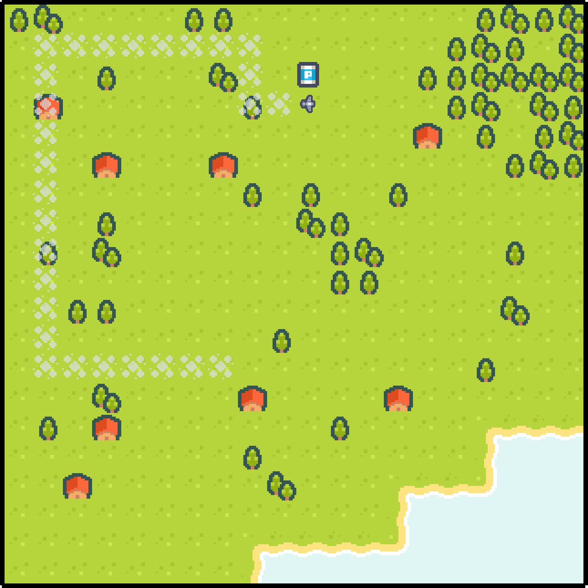

<h1 align="center">pySnake</h1>

<p align="center">
  
</p>

<p align="center">Ein Python-Spiel, inspiriert von Snake, bei dem du ein Flugzeug steuerst und Treibstofftanks sammelst.</p>

## Anleitung

**Steuerung:**

- Verwende die **W**-Taste, um das Flugzeug nach oben zu bewegen.
- Die **A**-Taste bewegt das Flugzeug nach links.
- Mit der **S**-Taste kannst du das Flugzeug nach unten steuern.
- Die **D**-Taste bewegt das Flugzeug nach rechts.

**Spielziel:**

Sammle so viele Treibstofftanks wie möglich, ohne gegen die Spielfeldgrenzen zu stoßen oder in den eigenen Abgasstrahl zu fliegen.

## Spielfeld

Das Spielfeld ist ein Raster von 20x20 Feldern. Die Begrenzungen sind durch Linien dargestellt. Deine Aufgabe ist es, die Treibstofftanks zu sammeln, ohne das Spielfeld zu verlassen oder in deinen eigenen Abgasstrahl zu fliegen.

## Installation

Bevor du das Spiel starten kannst, stelle sicher, dass du die benötigten Bibliotheken installiert hast. Du kannst dies tun, indem du `requirements.txt` verwendest. Hier ist eine Möglichkeit, die Abhängigkeiten zu installieren:

```bash
pip install -r requirements.txt
```

## Assets

- Die Grafiken für das Spiel stammen von [Kenney's Pixel Shmup Assets](https://kenney-assets.itch.io/pixel-shmup) auf itch.io.